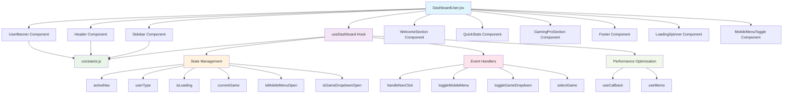
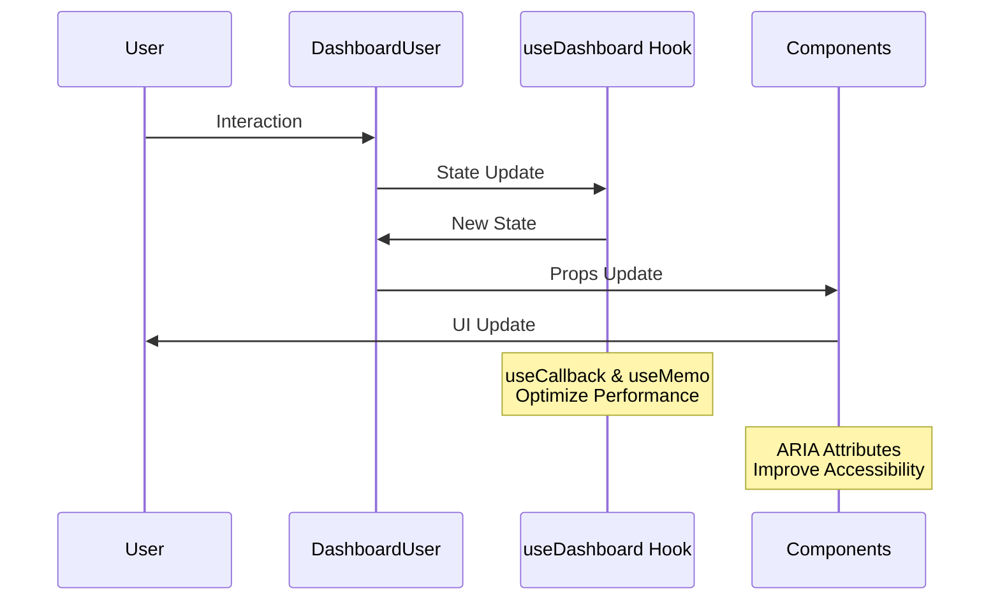
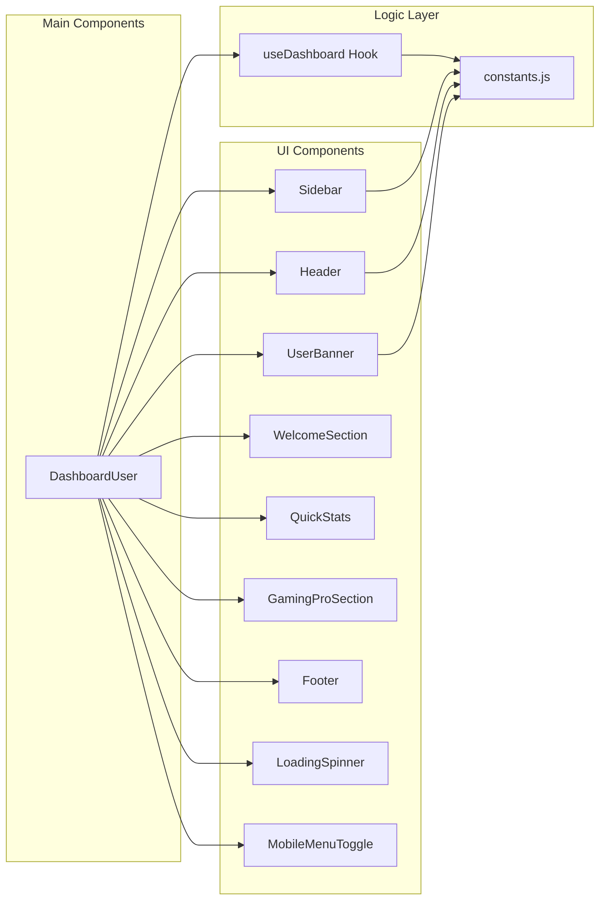

# Architecture du DashboardUser Refactorisé

## Diagramme d'Architecture

## Flux de Données

## Structure des Composants

## Avantages de l'Architecture

### 🎯 **Séparation des Responsabilités**
- **Composants** : Interface utilisateur uniquement
- **Hooks** : Logique métier et état
- **Constantes** : Configuration centralisée

### ⚡ **Performance**
- `useCallback` pour les fonctions
- `useMemo` pour les valeurs calculées
- Composants optimisés pour éviter les re-renders

### ♿ **Accessibilité**
- Attributs ARIA appropriés
- Navigation au clavier
- Structure sémantique HTML5

### 🔧 **Maintenabilité**
- Code modulaire et réutilisable
- Tests unitaires facilités
- Documentation intégrée
